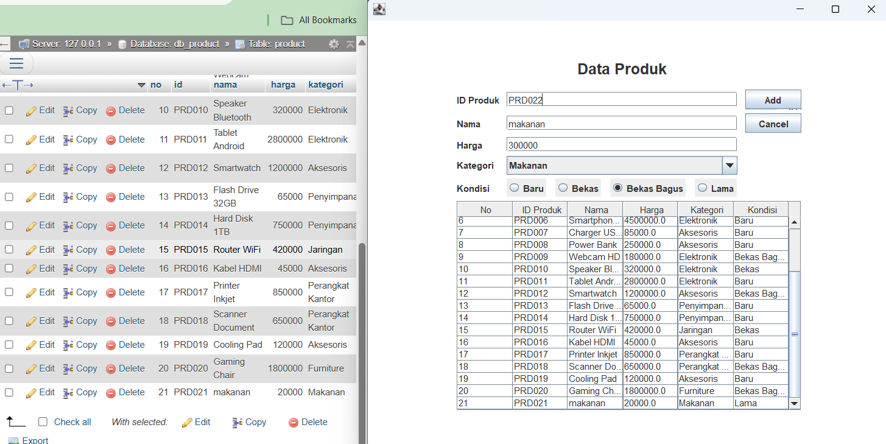
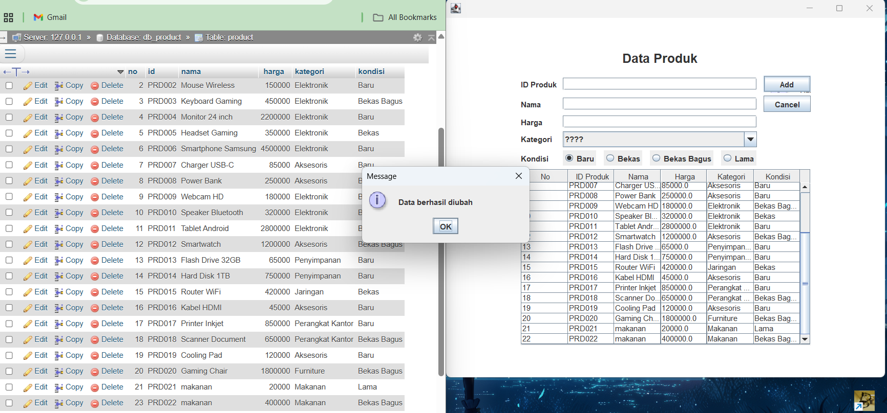
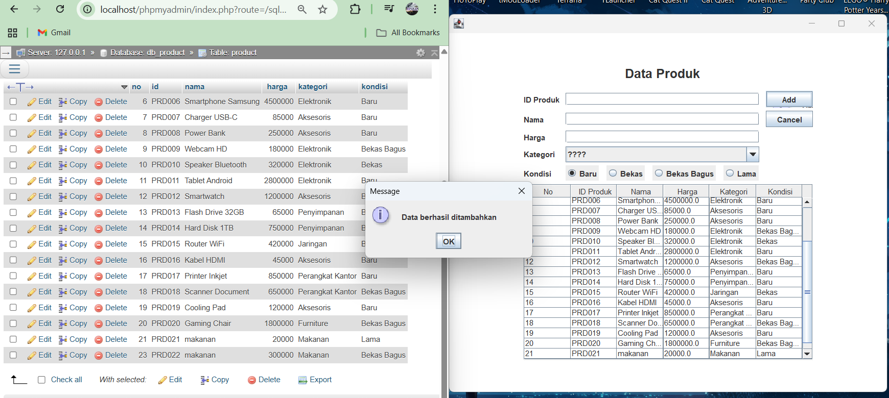
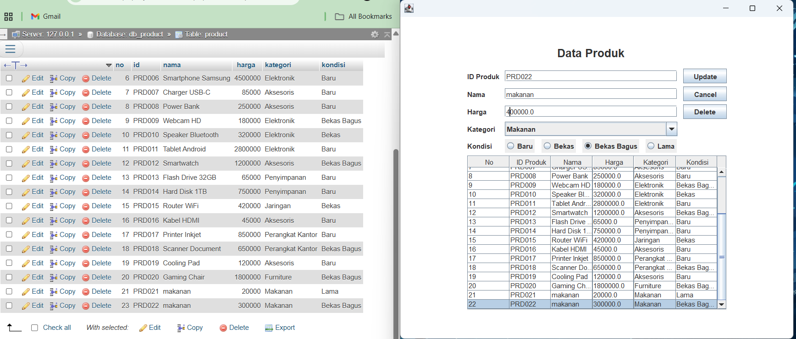

# TP5DPBO2425C2

Saya Rifa Muhammad Danindra dengan Nim 2405981 mengerjakan tugas praktikum 5 dalam mata kuliah Desain Pemrograman Berorientasi Objek untuk keberkahan-Nya maka saya tidak akan melakukan kecurangan seperti yang telah di spesifikasikan Aamiin.

Desain Program

Dalam Kelas Product Menu Sendiri ada Beberapa Atribut

 - id
 - harga
 - nama
 - kategori
 - kondisi

untuk gambar desain tabelnya

Penjelasan Alur

alur dari program ini dimulai dari kelas productmenu terlebih dahulu lalu setelah itu lanjut ke listener listener action yang bisa dilakukan
lalu lanjut ke pembuatan tabelnya dan selanjutnya ada insert, update, delete dan juga clear form

alur dari tabelnya sendiri yaitu ada kolom kolomnya untuk mengisi nama, harga, id dan combo box untuk kategori dan radio button untuk kondisi lalu bisa diisi lalu diadd
kalu di update bisa dengan memencet salah satu data yang ada di tabel lalu ubah atribut yang ingin diubah dan update, dan untuk delete hanya pencet data yang ingin di delete lalu pencet delete

saat mengisi data

setelah data diisi lalu di add

saat ingin mengupdate data

saat data sudah diupdate

saat data sudah berhasil dihapus

