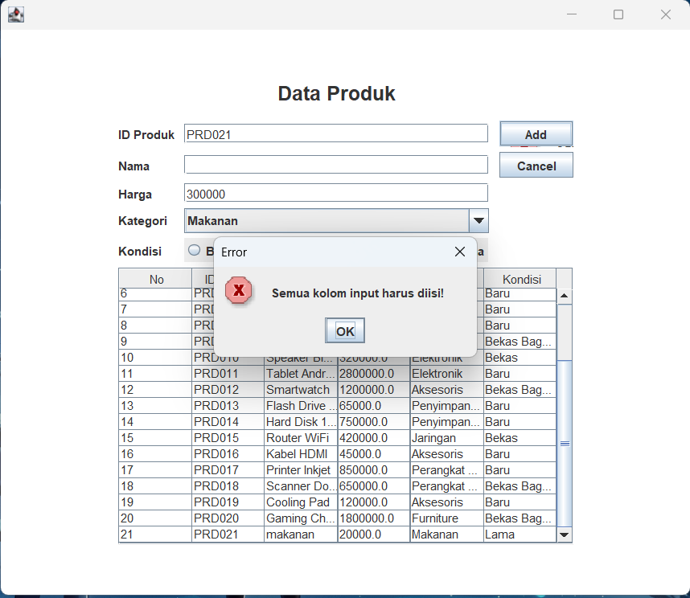
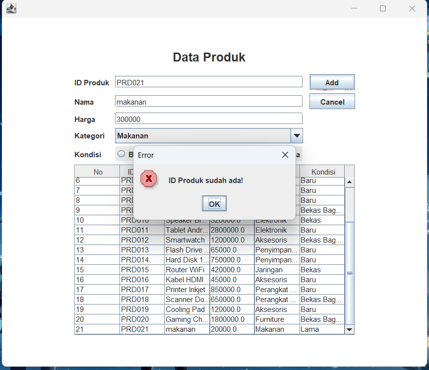

# TP5DPBO2425C2

Saya Rifa Muhammad Danindra dengan Nim 2405981 mengerjakan tugas praktikum 5 dalam mata kuliah Desain Pemrograman Berorientasi Objek untuk keberkahan-Nya maka saya tidak akan melakukan kecurangan seperti yang telah di spesifikasikan Aamiin.

Desain Program

Dalam Kelas Product Menu Sendiri ada Beberapa Atribut

  - id
  - harga
  - nama
  - kategori
  - kondisi

untuk gambar desain tabelnya

Penjelasan Alur

alur kode ini dimulai dari penyambungan program ke database lalu lanjut ke penyiapan tabel yaitu settable lalu berlanjut ke komponen komponen GUI yang ada di tabelnya lalu dilanjut ke event listener untuk tombol tombol yang ada seperti add/update delete cancel dan table yang datanya bisa dipencet

lalu di tabelnya alur yang pertama ada memilih data di tabel yang akan mengubah tombol add menjadi update lalu ada menmabah data baru yang memiliki confirmation kalau datanya suda terisi semua ataupun id yang ditambahkan tidak ada yang sama lalu ada menghapus data yang jika kkita memencet sati data di tabel akan ada tombol delete yang muncul dan terkahir ada clearform yang untuk mereset tampilan GUI ke awal

saat mengisi data

setelah data diisi lalu di add

saat ingin mengupdate data

saat data sudah diupdate

saat data sudah berhasil dihapus

error yang muncul apabila ada kolom yang kosong

error yang muncull saat menaruh id yang sudah ada

